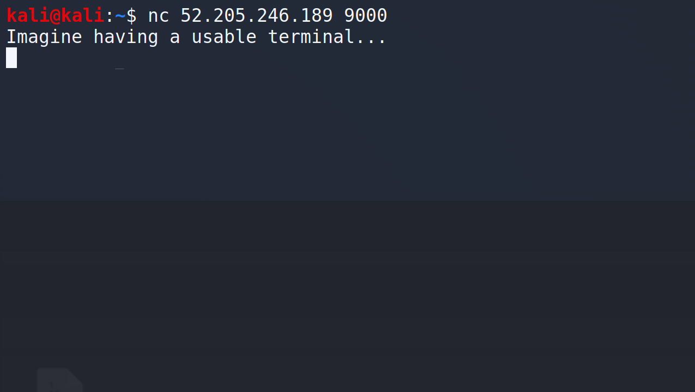

# **TJCTF 2020**

TJCTF is a Capture the Flag (CTF) competition hosted by TJHSST's Computer Security Club. It is an online, jeopardy-style competition targeted at high schoolers interested in Computer Science and Cybersecurity. Participants may compete on a team of up to 5 people, and will solve problems in categories such as Binary Exploitation, Reverse Engineering, Web Exploitation, Forensics, and Cryptography in order to gain points. The eligible teams with the most points will win prizes at the end of the competition.

***

# Miscellaneous

### A First Step
Every journey has to start somewhere -- this one starts here (probably).
The first flag is tjctf{so0p3r_d0oper_5ecr3t}. Submit it to get your first points!

**tjctf{so0p3r_d0oper_5ecr3t}**

```
Flag is in the challenge's description
```

### Discord
Strife, conflict, friction, hostility, disagreement. Come chat with us! We'll be sending out announcements and other important information, and maybe even a flag!

**tjctf{we_love_wumpus}**

```
Flag is pinned in the Discord server announcements channel
```

### Censorship
My friend has some top-secret government intel. He left a message, but the government censored him! They didn't want the information to be leaked, but can you find out what he was trying to say?

` nc p1.tjctf.org 8003 `

**tjctf{TH3_1llum1n4ti_I5_R3aL}**

```
This challenge I solved by mistake actually but the solution is
somewhat straightforward, when we connect to the server
we are greeted with the following meessege:
```


```
When we submit the answer (in this case it's obviously 27) we get following meessege:
```


```
Which is not the flag (trust me i checked multiple times), when we sumbit a wrong answer we get nothing,
my first thought was that the flag returned is random and there is a chance that the real flag will be returned,
so i wrote a short python script which connects to the server, reads the question and answers it:
```
```python 3
from pwn import remote
import re

host = "p1.tjctf.org"
port = 8003
s = remote(host, port)
question = s.recvuntil('\n')
numbers = re.findall('[0-9]+',str(question))
sum = sum([int(a) for a in numbers])
s.send('{}\n'.format(sum))
print(s.recv())
s.close()
```
```
and during debugging I noticed something strange is happening with the output:
```


```
as you can see the server is actually returing us the flag each time we answer correctly.
but, we can't see it when the output is printed in the terminal,
the reason is that '\r' symbol after the flag, the symbol stands for carriage return,
and in most terminal nowdays it deletes the written messege and returns the cursor to the start of line,
using this symbol can actually make cool loking animation and most of the animation
we see in terminals nowdays use this symbol.
```

### Timed
I found this cool program that times how long Python commands take to run! Unfortunately, the owner seems very paranoid, so there's not really much that you can test. The flag is located in the file flag.txt on the server.

` nc p1.tjctf.org 8005`

**tjctf{iTs_T1m3_f0r_a_flaggg}**

```
When we connect to the server we get the following messege:
```


```
I tried using Unix commands first and quickly discovered by the error messeges
that the commands need to be python commands, furthermore, we can't see the output
of the executed commands and but only the time it took for the commands to execute
or an error message if an error occurred while executing the commands.
I tried using python commands and modules
to escape the shell or get a reverse shell going from the server to my host,
for each command I tried I got the following messege:
```


```
At this point I gave up on getting a shell and tried to see what I can
do in this limited enviroment, I wanted to determine first if the commands are
executed in python 2 or python 3, for that I checked if python recognized
basestring, an abstract type which can't be found in python 3 and will raise an
exception:
```


```
executing basestring in the server didn't return an error messege so I determined
that the enviroment is python 2, in this point I tried to check if I can read the
file flag.txt:
```


```
We can read flag.txt !, now we need to discover the flag using our only
two availiable outputs - the time to execute a command or an error message if
such error produces.
We can do this by going letter by letter and executing a command that compares
the selected letter with a letter in the flag such that if the letters match the output
will be different so we can easily point out the matching letters and build the flag.
There are two ways to do this, The first one is to use commands such
that if the letter matches the execution time will be longer and by doing
so the total runtime returned will be grater, an exemple of this is linked in the resources.
the second one and the one that I used is to raise an exception if the letter match in
the position such that we can the discovery of the letter is not time bound.
for doing that I wrote the following code in python 3 using the pwntools module:
```
```python 3
from pwn import remote
import string

host = "p1.tjctf.org"
port = 8005
s = remote(host, port)
flag = ""
index = 0
changed = True
s.recvuntil('!\n')
while changed:
    changed = False
    for c in '_{}' + string.printable:
    	print("testing {}".format(flag + c))
    	command = '''1/0 if open('flag.txt','r').read({})[{}] == ''{}' else 0\n'''.format(index + 1, index, c)
    	print(command)
    	s.send(command)
    	answer = s.recvuntil("!\n")
    	if b'Traceback' in answer:
    		flag += c
    		changed = True
    		index += 1
    		break

```

```
as you can see, the code connects to the server and builds the flag by iterating
over all the printable characters and checking if the command executed raises an
error or not, the command simply checks if the character in a specific position
matches the current tested character and if it does it calculates 1/0 which in python
throw an exception (believe it or not there are langauges where 1/0 returns infinity)
else the command does nothing, if an error was raised then the letter is added to the flag
and the code moves to iterate over the next character in the flie, if we finished iterating over all
the characters and none of them raised a flag we can conclude that we discovered all the
flag, and we can see that the code does just that:
```


```
Side note: when writing the writeup I thought about another very easy way to get the
flag, We know that we can see errors happening in the execution of commends so
we can just raise an error with the flag !, for that you need you need to use the error
type NameError to raise an error with a string but it is still a much easier and very cool
 way to get the flag, you can see it in action in the following picture:
```


**Resources:**
* Pwntools : http://docs.pwntools.com
* All-Army Cyberstakes! Dumping SQLite Database w/ Timing Attack :  https://youtu.be/fZ3mPRctbO0

### Truly Terrible Why
Your friend gave you a remote shell to his computer and challenged you to get in, but something seems a little off... The terminal you have seems almost like it isn't responding to any of the commands you put in! Figure out how to fix the problem and get into his account to find the flag! Note: networking has been disabled on the remote shell that you have. Also, if the problem immediately kicks you off after typing in one command, it is broken. Please let the organizers know if that happens.
hint : Think about program I/O on linux

**tjctf{ptys_sure_are_neat}**

```
This challenge was very fair in my opinion but it was easy to overcomplicate it
(as I admittedly did in the beginning).
When you connect to the server you are greeted with the following messege:
```


```
and for every input we give no output is returned.
First I tried doing blind reading of the files in the server using similar methods as I used in Timed but
the only true way I found to do that was to disconnect from the server using exit
every time a character match... which quickly led to me being banned from the server and
so I stopped and moved to other challenges.
in the meantime the challenge was patched and using the exit command no longer worked,
and the hint was published.
as the hint suggested there is something off about the I/O of the shell
such that we can't see the output.
and so I tried using output redirection so that the output of the commands will be redircted
to the standard output (file descriptor 0) et voila:
```


```
We got a working shell !, from thereon I tried getting an interactive shell using the common methods
(listed in resources) and spawned a new shell with the output redirected to standard output:
```


```
Now we can now use the shell as (almost) a regular shell, so we can use the arrow keys and
use the sudo command, We can also see now that we are connected as problem-user.
Let's see what is written in the text files:
```


```
From the messege we can assume that we need to connect to other-user, and because we are given
problem-user password we will probably need to use it for that.
the first Thing I do in this situation is to check the user sodu privillages using sudo -l command:
```


```
So we run /usr/bin/chguser as root:
```


```
And as you can see by doing we connect to other-user and we are dropped at his home folder,
and we got our flag.
```
**Resources:**
* Getting fully interactive shell : https://blog.ropnop.com/upgrading-simple-shells-to-fully-interactive-ttys/
* Linux Redirection : https://www.guru99.com/linux-redirection.html

### Zipped Up
My friend changed the password of his Minecraft account that I was using so that I would stop being so addicted. Now he wants me to work for the password and sent me this zip file. I tried unzipping the folder, but it just led to another zipped file. Can you find me the password so I can play Minecraft again?

[link](https://static.tjctf.org/663d7cda5bde67bd38a8de1f07fb9fab9dd8dd0b75607bb459c899acb0ace980_0.zip)

**tjctf{p3sky_z1p_f1L35}**
```
This type of challange is pretty common in CTFs and most of the times it can be summed
up to tweaking the code so that it will work with the current challenge,
as you can see each compressed file contains a txt and another compressed file,
if you look further you can see that there is a false flag tjctf{n0t_th3_fl4g}
in some txt files (actually in all of them but one).
so I wrote (mostly tweaked) my code to not only find compressed files in the working directory and unzip them,
but also check the content of the txt file and if it's not the false flag print it and stop the execution:
```
```bash
#!/bin/bash
get_flag() {
	for filename in $(pwd)/*; do
		echo "$filename"
		if [[ $(mimetype -b "$filename") == "application/zip" ]]
		then
			unzip "$filename"
			find_dir
			return
		elif [[ $(mimetype -b "$filename") == "application/x-tar" ]]
		then
			tar -xf "$filename"
			find_dir
			return
		elif [[ $(mimetype -b "$filename") == "application/x-bzip-compressed-tar" ]]
		then
			tar -xf "$filename"
			find_dir
			return
		elif [[ $(mimetype -b "$filename") == "application/x-compressed-tar" ]]
		then
			tar -xf "$filename"
			find_dir
			return
		elif [[ $(mimetype -b "$filename") == "text/plain" ]]
		then
			if [[ $(cat "$filename") != "tjctf{n0t_th3_fl4g}" ]]
			then
				cat "$filename"
				return
			fi
		fi
	done
}

find_dir(){
	for filename in $(pwd)/*; do
		if [[ -d "$filename" ]]
			then
				cd "$filename"
				get_flag
				return
		fi
	done
}
echo start
get_flag
```
```
And after 829 (!) files unzipped we find the first (and afaik the only) txt file that contains the flag.
```
***

# Web

### Broken Button
This site is telling me all I need to do is click a button to find the flag! Is it really that easy?

[link](https://broken_button.tjctf.org/)

**tjctf{wHa1_A_Gr8_1nsp3ct0r!}**

```
when we go to the site we get this massage:
```

```
If we Inspect the site (Ctrl+Shift+I) we see that there is a hidden button in
the HTML code:
```

```
And when we look at the HTML file that is referenced by the by the hidden
button we get our flag.
```

***
# Cryptography
### Speedrunner
I want to make it into the hall of fame -- a top runner in "The History of American Dad Speedrunning". But to do that, I'll need to be faster. I found some weird parts in the American Dad source code. I think it might help me become the best.

[link](https://static.tjctf.org/6e61ec43e56cff1441f4cef46594bf75869a2c66cb47e86699e36577fbc746ff_encoded.txt)

**tjctf{new_tech_new_tech_go_fast_go_fast}**
```
In the link we get the following ciphertext:
```
LJW HXD YUNJBN WXC DBN CQN CNAV "FXAUM ANLXAM'? RC'B ENAH VRBUNJMRWP JWM JBBDVNB CQJC CQN ERMNX YXBCNM RB CQN OJBCNBC CRVN, FQNAN RW OJLC BXVNXWN NUBN LXDUM QJEN J OJBCNA, DWANLXAMNM ENABRXW. LXDUM HXD YUNJBN DBN CQN CNAV KTCFENJJJEKVXOBAL (KNBC TWXFW CRVN FRCQ ERMNX NERMNWLN JB JYYAXENM JWM ENARORNM KH VNVKNAB XO CQN BYNNM ADWWRWP LXVVDWRCH) RW CQN ODCDAN. CQRB FXDUM QNUY UXFNA LXWODBRXW RW CQNBN CHYNB XO ERMNXB RW ANPJAM CX CQN NENA DYMJCRWP JWM NEXUERWP WJCDAN XO CQN BYNNMADWWRWP LXVVDWRCH.

CSLCO{WNF_CNLQ_WNF_CNLQ_PX_OJBC_PX_OJBC}
```
We can notice that the format of the last line somewhat matches the format for the flag so we can
assume the cipher is letter substitution, a type of cipher where each letter in
the plaintext is  subtituted with another letter , I copied the text to CyberText
and tried to use shift ciphers to decrpyt the messege, shift cipher are a type
of cipher where every letter is shifted by a known offset to a different letter,
ROT13 and Ceaser Cipher are some famous exemple of this type of cipher where the
offset is 13 and 3 respectably, with an offset of 17 we get the following message:
```
CAN YOU PLEASE NOT USE THE TERM "WORLD RECORD'? IT'S VERY MISLEADING AND ASSUMES THAT THE VIDEO POSTED IS THE FASTEST TIME, WHERE IN FACT SOMEONE ELSE COULD HAVE A FASTER, UNRECORDED VERSION. COULD YOU PLEASE USE THE TERM BKTWVEAAAVBMOFSRC (BEST KNOWN TIME WITH VIDEO EVIDENCE AS APPROVED AND VERIFIED BY MEMBERS OF THE SPEED RUNNING COMMUNITY) IN THE FUTURE. THIS WOULD HELP LOWER CONFUSION IN THESE TYPES OF VIDEOS IN REGARD TO THE EVER UPDATING AND EVOLVING NATURE OF THE SPEEDRUNNING COMMUNITY.

TJCTF{NEW_TECH_NEW_TECH_GO_FAST_GO_FAST}

**Resources:**
* CyberChef : https://gchq.github.io/CyberChef/
* Ceaser Cipher : https://en.wikipedia.org/wiki/Caesar_cipher
* Substitution Cipher : https://en.wikipedia.org/wiki/Substitution_cipher

***
# Reversing

### Forwarding
It can't be that hard... right?

[link](https://static.tjctf.org/d9c4527bc1d5c58c1192f00f2e2ff68f84c345fd2522aeee63a0916897197a7a_forwarding)

**tjctf{just_g3tt1n9_st4rt3d}**
```
this time we get a file with the challenge, if we check the type of the file
we can see that it is an ELF, a type of Unix executable:
```

```
I checked if the flag is saved in string format in the file, we
can use the strings command to find strings in the executable, and then use
grep and regex to filter the strings in the binary for the flag
I used the following command:

strings forwarding | grep 'tjctf{.*}'

and got the following output:
```


**Resources:**
* ELF file : https://en.wikipedia.org/wiki/Executable_and_Linkable_Form
* Regex : https://en.wikipedia.org/wiki/Regular_expression
